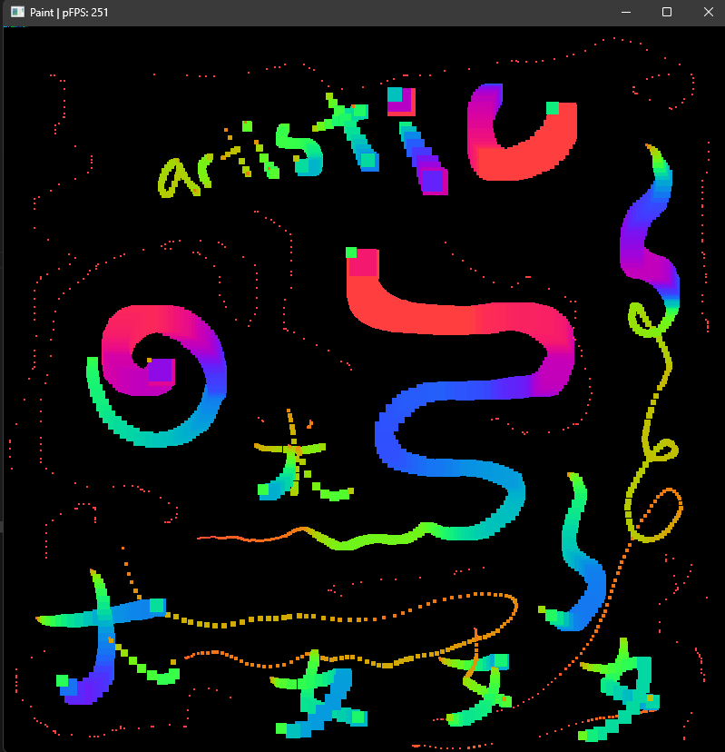

# Tool 1

This is a prototype of a paint tool using C17 on Windows. 
- It supports pen pressure input.
- It uses CPU to draw to an in-memory heap buffer, which is copied to GPU on every frame.

## Prerequisites
- Windows 8 or newer (for Windows Ink support)
- Vulkan SDK (not-included)  
  https://www.lunarg.com/vulkan-sdk/
- SDL2 (included)
- GLM (included)
- Clang (recommended)

## Screenshot


## Building

### on Windows
   ```
   C:\> node build_scripts/Makefile.mjs all
   ```

### on Linux
```bash
# Install Vulkan SDK
wget -qO- https://packages.lunarg.com/lunarg-signing-key-pub.asc | sudo tee /etc/apt/trusted.gpg.d/lunarg.asc
sudo wget -qO /etc/apt/sources.list.d/lunarg-vulkan-jammy.list http://packages.lunarg.com/vulkan/lunarg-vulkan-jammy.list
sudo apt update
sudo apt install vulkan-sdk vulkan-tools vulkan-validationlayers-dev spirv-tools

# Install SDL2
sudo apt install libsdl2-dev

# Install Clang compiler
sudo apt install clang

# Install Node.js
curl -o- https://raw.githubusercontent.com/nvm-sh/nvm/v0.39.7/install.sh | bash
cd build_scripts/
nvm install
npm install
cd ..

# Build
node build_scripts/Makefile.mjs all
```

### on Mac
```bash
# Install Vulkan SDK
https://sdk.lunarg.com/sdk/download/1.3.275.0/mac/vulkansdk-macos-1.3.275.0.dmg

# Install SDL2
brew install sdl2

# Install Node.js
curl -o- https://raw.githubusercontent.com/nvm-sh/nvm/v0.39.7/install.sh | bash
cd build_scripts/
nvm install
npm install
cd ..

# Build
node build_scripts/Makefile.mjs all
```

## Debugging
- Can use VSCode (see `.vscode/tasks.json`), or;
- Can debug with `gdb`
